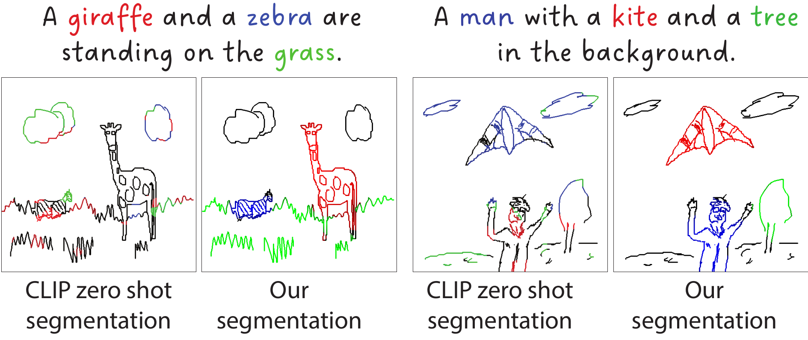

<<<<<<< HEAD
# Open Vocabulary Scene Sketch Semantic Understanding
Code release for "Open Vocabulary Scene Sketch Semantic Understanding" (arXiv 2023)



**Abstract**: We study the underexplored but fundamental vision problem of machine understanding of abstract freehand scene sketches.
We introduce a sketch encoder that results in semantically-aware feature space, which we evaluate by testing its performance on a semantic sketch segmentation task.
To train our model we rely only on the availability of bitmap sketches with their brief captions and do not require any pixel-level annotations. 
To obtain generalization to a large set of sketches and categories, we build on a vision transformer encoder pretrained with the CLIP model. 
We freeze the text encoder and perform visual-prompt tuning of the visual encoder branch while introducing a set of critical modifications. 
Firstly, we augment the classical key-query (k-q) self-attention blocks with value-value (v-v) self-attention blocks. 
Central to our model is a two-level hierarchical network design that enables efficient semantic disentanglement: The first level ensures holistic scene sketch encoding, and the second level focuses on individual categories.
We, then, in the second level of the hierarchy, introduce a cross-attention between textual and visual branches.
Our method outperforms zero-shot CLIP pixel accuracy of segmentation results by 37 points, reaching an accuracy of $85.5\%$ on the FS-COCO sketch dataset.
Finally, we conduct a user study that allows us to identify further improvements needed over our method to reconcile machine and human understanding of scene sketches.
# News
- **2023.12.05**: demo code is released.

# Usage
### Running demo.py
- The version requirements of core dependencies.
```
pip install torch==1.9.1+cu111 torchvision==0.10.1+cu111 torchaudio==0.9.1 -f https://download.pytorch.org/whl/torch_stable.html

```
- Download the checkpoint `sketch_seg_best_miou.pth` and save it in `checkpoint` folder. A use case can be found in `demo.py`.
```
python demo.py --config-file vpt/configs/prompt/cub.yaml checkpoint_path checkpoint/sketch_seg_best_miou.pth sketch_path demo/sketch_1.png threshold 0.5
```
### Training code (to be released soon)

