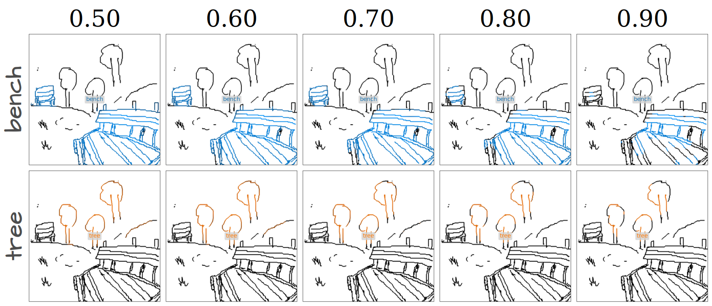

# Open Vocabulary Scene Sketch Semantic Understanding

We present the first language-supervised scene sketch segmentation method. Our approach employs a dual-level network architecture designed to effectively disentangle different object categories within scene sketches, utilizing only brief captions as guidance. 

[**Open Vocabulary Scene Sketch Semantic Understanding**](https://ahmedbourouis.github.io/Scene_Sketch_Segmentation/), 
[*Ahmed Bourouis*](https://www.surrey.ac.uk/people/ahmed-bourouis),
[*Judith Ellen Fan*](https://profiles.stanford.edu/judith-fan),
[*Yulia Gryaditskaya*](https://yulia.gryaditskaya.com/).

<div align="center">

</div>

# News
- **26.02.2024**: Train code released
- **26.02.2024**: Paper accepted at CVPR'24 :tada: 
- **05.12.2023**: Demo code is released.


# Inference
- Given a desirable set of categories (or a brief caption) for a given sketch image, we encode these categories with the CLIP text encoder. 
- We compute the per-patch cosine similarity between the class embeddings and the scene sketch patch embeddings. The resulting similarity matrix represents the category label probabilities for each individual patch. 
- To generate a pixel-level similarity map, we reshape the resulting per-patch similarity maps then upscale to the dimensions of the original scene sketch using bi-cubic interpolation.

<div align="center">


</div>

## Isolate individual categories
If we want to isolate just a few categories in the sketch, we only retain pixels with category-sketch similarity scores above a pre-set threshold value. Below we visualize this process for different threshold values. 
<div align="center">

</div>

# Usage

## Running demo.py
- The version requirements of core dependencies.
```
pip install torch==1.9.1+cu111 torchvision==0.10.1+cu111 torchaudio==0.9.1 -f https://download.pytorch.org/whl/torch_stable.html

```
- Download checkpoint `sketch_seg_best_miou.pth` from [here](https://drive.google.com/drive/folders/1TdA5B-cZWJOZgZzVzHhAAIEoM9NOBFvM?usp=sharing) and save it in `checkpoint` folder. 


- A use case can be found in `demo.py`. From just a sketch image and condidate categories, we can generate scene sketch segmentation maps.
 
```
python demo.py --config-file vpt/configs/prompt/cub.yaml checkpoint_path checkpoint/sketch_seg_best_miou.pth sketch_path demo/sketch_1.png output_path demo/results/output.png threshold 0.6
```
### Hyper-parameters
- `config-file`:
  main config setups for experiments and explanation for each of them. 
- `checkpoint_path`:
  path for the model checkpoint.
- `sketch_path`:
  sketch image example path.
- `output_path`:
  path to save the output sketch.
- `threshold`:
  the threshold value for class-pixel similarity scores to retain.
 

## Training: 
- Upload the dataset from here and put it in /DATA directory.

- Run the following for training the model.
```
python train.py --config-file vpt/configs/prompt/cub.yaml MODEL.PROMPT.NUM_TOKENS 3 MODEL.PROMPT.LOG "first_run" save_every 5 learning_rate 1e-6 bz 16  WANDB False 
```

### Hyper-parameters
- `config-file`:
  main config setups for experiments and explanation for each of them. 
- `checkpoint_path`:
  path for the model checkpoint.
- `MODEL.PROMPT.NUM_TOKENS`:
  number of trainable visual tokens to use for CLIP fine-tuning.
- `MODEL.PROMPT.LOG`:
  log name.
- `save_every`:
  save model weights every # epochs.
- `learning_rate`:
  learning rate
- `bz`:
  training batch size.
- `WANDB`:
  whether to log your training to WandB or not.
  

# Citation
If you find this paper useful in your research, please consider citing:
```
@misc{bourouis2023open,
title={Open Vocabulary Semantic Scene Sketch Understanding}, 
author={Ahmed Bourouis and Judith Ellen Fan and Yulia Gryaditskaya},
year={2023},
eprint={2312.12463},
archivePrefix={arXiv},
primaryClass={cs.CV}
}
```
