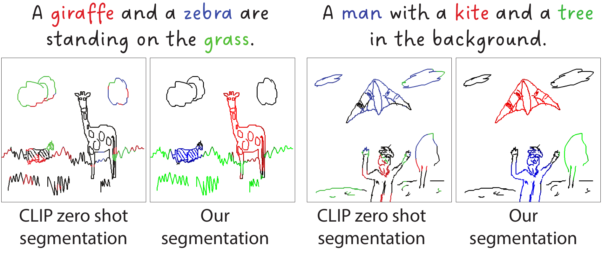

# Open Vocabulary Scene Sketch Semantic Understanding

We present the first language-supervised scene sketch segmentation method. Our approach employs a dual-level network architecture designed to effectively disentangle different object categories within scene sketches, utilizing only brief captions as guidance. 

[**Open Vocabulary Scene Sketch Semantic Understanding**](https://ahmedbourouis.github.io/Scene_Sketch_Segmentation/), 
[*Ahmed Bourouis*](https://www.surrey.ac.uk/people/ahmed-bourouis),
[*Judith Ellen Fan*](https://profiles.stanford.edu/judith-fan),
[*Yulia Gryaditskaya*](https://yulia.gryaditskaya.com/).



# News
- **2023.12.05**: demo code is released.


# Inference
- Given a desirable set of categories (or a brief caption) for a given sketch image, we encode these categories with the CLIP text encoder. 
- We compute the per-patch cosine similarity between the class embeddings and the scene sketch patch embeddings. The resulting similarity matrix represents the category label probabilities for each individual patch. 
- To generate a pixel-level similarity map, we reshape the resulting per-patch similarity maps then upscale to the dimensions of the original scene sketch using bi-cubic interpolation.

<div align="center">


## Isolate individual categories


# Usage

## Running demo.py
- The version requirements of core dependencies.
```
pip install torch==1.9.1+cu111 torchvision==0.10.1+cu111 torchaudio==0.9.1 -f https://download.pytorch.org/whl/torch_stable.html

```
- Download checkpoint `sketch_seg_best_miou.pth` from [here](https://drive.google.com/drive/folders/1TdA5B-cZWJOZgZzVzHhAAIEoM9NOBFvM?usp=sharing) and save it in `checkpoint` folder. 


- A use case can be found in `demo.py`. From just a sketch image and condidate categories, we can generate scene sketch segmentation maps.
 
```
python demo.py --config-file vpt/configs/prompt/cub.yaml checkpoint_path checkpoint/sketch_seg_best_miou.pth sketch_path demo/sketch_1.png threshold 0.5
```
### Hyper-parameters
- `config-file`:
  main config setups for experiments and explanation for each of them. 
- `checkpoint_path`:
  path for the model checkpoint.
- `sketch_path`:
  sketch image example path.
- `threshold`:
  the threshold value for class-pixel similarity scores to retain during inference.
 

## Training code (to be released soon)


# Citation
If you find this paper useful in your research, please consider citing:
```
@article{bourouis2023SSU,
  author   = {Bourouis, Ahmed and Fan, Judith Ellen and Gryaditskaya, Yulia},
  title    = {Open Vocabulary Scene Sketch Semantic Understanding},
  year     = {2023},
}
```
